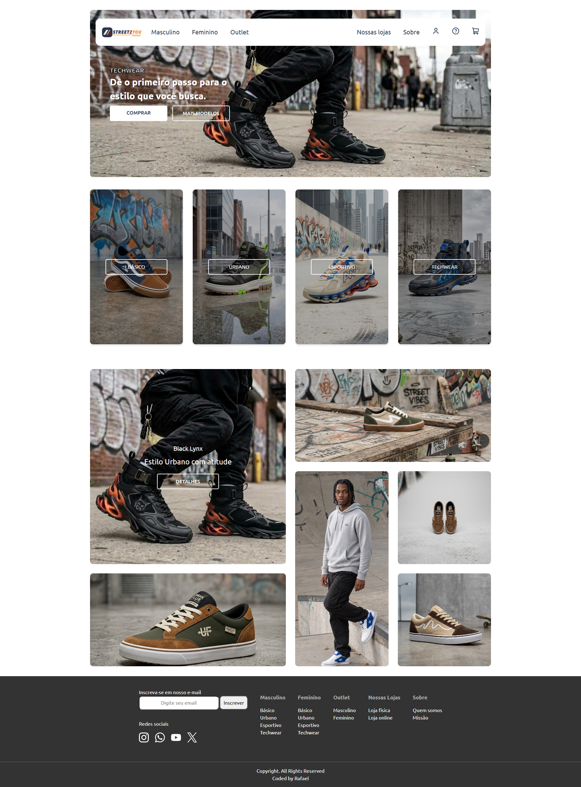
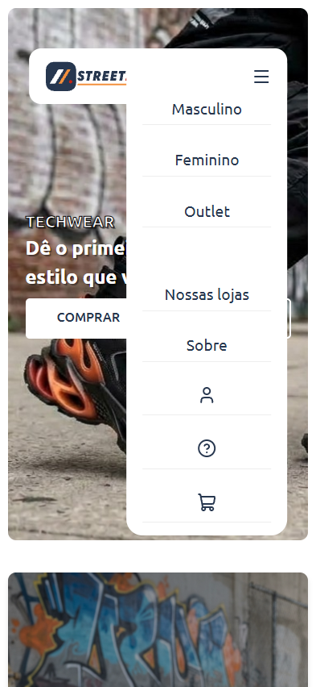

# Street2You 👟🔥
 
> *The streets that find you.*
 
**Street2You** is a modern, responsive e-commerce landing page focused on urban fashion and streetwear culture. The project was built with an emphasis on semantic HTML5 structure, modular CSS3 architecture, and responsive design adapted for multiple screen sizes.
 
<div align="center">
[](https://0rafae1.github.io/ecommerce-street2you/)
 
👉 **[Click here for the live demo](https://0rafae1.github.io/ecommerce-street2you/)** 👈
 
</div>
---
 
## Table of contents
 
- [Overview](#overview)
  - [About the project](#about-the-project)
  - [Screenshot](#screenshot)
  - [Links](#links)
- [My process](#my-process)
  - [Built with](#built-with)
  - [What I learned](#what-i-learned)
  - [Continued development](#continued-development)
  - [Useful resources](#useful-resources)
  - [AI Collaboration](#ai-collaboration)
- [Author](#author)
## Overview
 
### About the project
 
The project showcases the digital storefront of the **Street2You** brand, featuring footwear and apparel collections such as Techwear, Basics, Urban, and Sportswear. The interface combines a clean visual aesthetic with smooth navigation, offering an immersive experience inspired by leading streetwear e-commerce sites.
 
Users should be able to:
 
- Navigate between product categories (Men, Women, Outlet) through a floating header
- See hover and focus states for all interactive elements on the page
- Open and close the navigation menu on mobile devices
- Browse the featured product mosaic, laid out for desktop, tablet, and mobile
- Sign up for the newsletter through the form in the footer
### Screenshot
 
<p align="center">
  
</p>
<p align="center">
  
  
</p>
 
### Links
 
- Solution repo: [GitHub repo](https://github.com/0rafae1/ecommerce-street2you)
- Live Site URL: [Live Preview](https://0rafae1.github.io/ecommerce-street2you/)
## My process
 
### Built with
 
- **Semantic HTML5:** proper use of tags like `<header>`, `<nav>`, `<main>`, `<section>`, `<article>`, and `<footer>` for accessibility and SEO.
- **CSS Grid Layout:** used to build the asymmetric product mosaic.
- **CSS Flexbox:** used to align and distribute elements in the header, category cards, and footer.
- **CSS Variables (Custom Properties):** centralized color and typography variables.
- **BEM naming convention:** component classes follow the Block__Element--Modifier pattern, and CSS custom properties follow a `--block--modifier` naming scheme inspired by BEM.
- **Media Queries:** responsive breakpoints at 1280px, 1000px, 768px, and 500px.
- **Modern CSS Reset:** based on *Andy Bell*'s solution, to keep styles consistent across browsers.
- **SVG Masks (`mask-image`):** used to control icon color and hover effects without needing multiple image files.
- **Typography:** Google Fonts ([Ubuntu](https://fonts.google.com/specimen/Ubuntu) and [Outfit](https://fonts.google.com/specimen/Outfit)).
### What I learned
 
I learned how to build a **CSS-only hamburger menu**, combining `<input type="checkbox">`, `<label>`, and the `:checked ~ .nav-container` selector, with no JavaScript required:
 
```html
<input type="checkbox" id="menu-toggle" class="menu-toggle" />
<label for="menu-toggle" class="hamburger"></label>
<nav class="nav-container">...</nav>
```
 
```css
.menu-toggle:checked ~ .nav-container {
  display: flex;
}
```
 
I also learned how to organize CSS into a **modular architecture**, splitting each component into its own file inside `css/components/`, and how to dynamically color SVG icons using `mask-image`, changing only the `background-color`, including on `:hover` states:
 
```css
.icon {
  -webkit-mask-image: url("./icon.svg");
  mask-image: url("./icon.svg");
  background-color: var(--color-icon);
}
 
.icon:hover {
  background-color: var(--color-icon-hover);
}
```
 
Later on, I migrated all component classes to the **BEM** convention (`Block__Element--Modifier`), which made the relationship between elements and their parent block explicit and cut down on naming collisions across files. I also renamed the color and typography custom properties to a `--block--modifier` pattern (e.g. `--color--primary`), applying the same "block first, modifier second" logic to variable names. It's worth noting that this isn't traditional BEM, since custom properties aren't classes and don't have elements or modifiers in the strict sense, but adapting the naming logic gave the variables a similar predictability and made the connection between a variable and where it's used easier to read at a glance. A quick before-and-after:
 
```css
/* Before */
.card-title { ... }
.btn-outline { ... }
 
:root {
  --primary-color: #F3903D;
  --text-color-light: #ffffff;
}
 
/* After */
.product-card__title { ... }
.btn--outline { ... }
 
:root {
  --color--primary: #F3903D;
  --color--text-light: #ffffff;
}
```
 
### Continued development
  
- [ ] Add JavaScript interactivity (shopping cart, shipping calculator, search bar)
- [ ] Add newsletter form validation
- [ ] Add a product details modal on "details" click
- [ ] Implement dark mode
### Useful resources
 
- [MDN - CSS Grid Layout](https://developer.mozilla.org/en-US/docs/Web/CSS/CSS_grid_layout) - main reference for understanding `grid-template-areas` and building the asymmetric mosaic
- [Modern CSS Reset (Andy Bell)](https://piccalil.li/blog/a-modern-css-reset/) - base used for the cross-browser style reset
### AI Collaboration
 
I used Claude as a structured pair programming assistant, focused on learning rather than generating solutions.
 
The AI focused on:
 
- Explaining concepts and reasoning
- Guiding problem-solving through hints and questions
- Reviewing decisions only after my own implementation
All code was written and reviewed by me, using AI strictly as a learning support tool.
 
## Author
 
Built by **Rafael** while studying at **Dev Quest**.
 
- LinkedIn - [Rafael Sousa](https://www.linkedin.com/in/orafael-sousa)
- Frontend Mentor - [@0rafae1](https://www.frontendmentor.io/profile/0rafae1)
- Outlook - [Email](mailto:rafaeltowork@outlook.com)
 